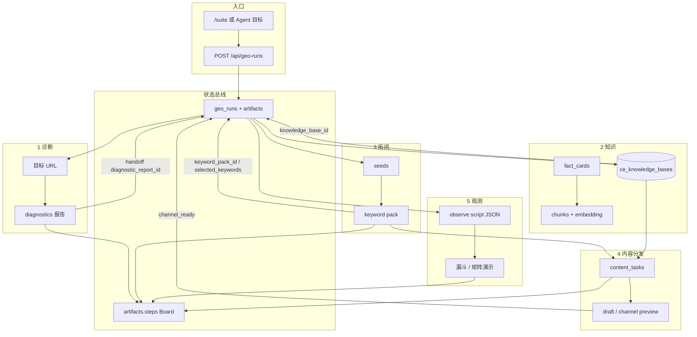

# GEO Suite 能否做成智能体？——可行性与全链路数据流

> 版本：2026-08-07  
> 问题：整条 GEO 主路径（诊断 → 知识 → 拓词 → 内容/分发 → 观测 → 配置）**能不能、以及怎样**做成智能体？  
> 结论摘要见 §1；逐步数据流与加工方式见 §3–§4。  
> 关联：[AGENT_DESIGN_8_QUESTIONS.md](./AGENT_DESIGN_8_QUESTIONS.md) · [content-engineering-sop.md](./content-engineering-sop.md) · [geo-suite.md](./geo-suite.md)

本文**不是**「拓词智能体」说明书。拓词只是第六能力中的一环；若只把拓词 Agent 化，Suite 仍是人工串页。

---

## 1. 判断结论（先给答案）

| 层级 | 判断 | 含义 |
|------|------|------|
| **A. 人机协作 Copilot（按步工具）** | **已经接近** | 每步有 API/页面；Run 可串 `run_id`；人点下一步 |
| **B. 编排型 Agent（单会话规划 → 调多工具 → 停在闸门）** | **条件具备，尚未做成** | 缺统一「GEO Agent」入口：目标解析、步间自动 handoff、失败重试策略 |
| **C. 全自动无人 Agent（诊断到观测闭环自跑）** | **现阶段不建议** | 观测多为演示剧本；外发被禁止；知识口径需人审；业务责任不可外包给模型 |

**一句话：**  
GEO 流程**适合做成「有闸门的编排智能体」**（B），以 Run Board 为状态机；**不适合**宣传成端到端黑盒全自动（C）。  
当前产品形态是 **A 偏 B**：总线与步骤已在，缺的是**统一编排层与步间契约自动化**。

### 1.1 接口三问视角（整条链路）

| 问 | 现状 | 做成 B 还差什么 |
|----|------|-----------------|
| **Q1 状态可见性** | `GET /geo-runs/{id}` + `artifacts` 可读 URL/报告/选题/任务/KB/就绪 | Agent 需稳定 schema：每步 `status/input_ref/output_ref/error` |
| **Q2 自主获取** | 诊断、KB 列表、拓词、任务、剧本均可 API 拉 | 缺「下一步该调哪个工具」的规划器；跨页状态仍部分靠前端 localStorage |
| **Q3 运行可视化** | `GET /geo-runs/{id}/steps` Board | 需保证**每步**写入结构化 step（含拓词 `knowledge_meta`、任务 id、观测 script_key），测试智能体能按 `run_id` 断言 |

### 1.2 推荐产品形态（若要做 Agent）

```text
用户目标（一句话）
  → GEO Orchestrator（规划：缺什么 / 下一步工具）
  → 工具：diagnostic | kb | expand | content_task | observe_preview | settings_read
  → 闸门：人确认（选词 / 审事实卡 / 标记分发就绪 / 解读观测）
  → 写回 Run.artifacts + steps Board
```

**禁止 Agent 擅自：** 真发渠道、把剧本写成实测引用率、跳过 L1 确认、删除知识库。

---

## 2. 主路径能力地图（人做 vs 机器做）

| 步 | 能力 | 今日谁主导 | 机器已做的加工 | 必须人闸门 |
|----|------|------------|----------------|------------|
| 0 | 配置 | 人 | 读 settings / 平台侧重 | 密钥、入口路径、演示开关 |
| 1 | 诊断 | 人发起 | SEO 规则分 + 可选 LLM 建议 | 认 P0、勿误读「引用率」 |
| 2 | 知识 | 人备料 | 切片、向量、分层可检索 | 事实卡口径、L1 确认、冲突消解 |
| 3 | 拓词 | 人点生成 | 归一化、画像、可选 KB 双通道、LLM、守卫过滤 | 勾选问法、确认是否绑库 |
| 4 | 内容/分发 | 人选题/模板 | RAG 填 Knowledge、模板生成、渠道壳预览 | 审稿、标记就绪（≠已发布） |
| 5 | 观测 | 人打开 | 剧本聚合 KPI/矩阵（演示） | 解读；禁止当实测 |

---

## 3. 全链路数据流向（Run 为总线）



**贯穿 ID：** `run_id`（URL query + handoff）。  
**前端辅状态：** `localStorage` Suite workflow（`runId` 缓存）；**以服务端 artifacts 为准**。

---

## 4. 每一步：输入 → 加工方式 → 输出 → 写入 Run

### 4.0 创建 Run / 配置

| | |
|--|--|
| **输入** | 可选 entity/竞品/平台；可选初始 `knowledge_base_id` |
| **加工** | 建 `geo_runs` 行；初始化 `artifacts`、空 `steps` |
| **输出** | `run_id` |
| **Agent 化要点** | 作为 session；所有工具强制带 `run_id` |

配置（`/settings`）是**只读工具 + 管理员写闸门**：Agent 可读平台侧重 / 内容后端模式，不可在演示外改密钥。

---

### 4.1 诊断（检查）

| | |
|--|--|
| **输入** | 网址 / 页面 HTML 或抓取结果 |
| **加工** | **规则为主**：Schema / 结构 / Meta / 外链就绪打分；可选 LLM 出修复建议（须约束口径） |
| **输出** | 诊断报告（分项分 + 建议列表） |
| **写入 Run** | `diagnostic_report_id`；step=`diagnostic` |
| **Agent 化要点** | 工具：`run_diagnostic(url)`；闸门：人确认 P0 是否修、是否继续知识步 |
| **边界** | 不得把「citation 就绪」说成「已被大模型引用」 |

---

### 4.2 知识库

| | |
|--|--|
| **输入** | 文档 / 事实卡 JSON / 示范包导入 |
| **加工** | **结构化 + 管道**：`ingest-tagged` 分层（L1–L4）；`fact_cards` 落 JSON；正文 `split_chunks(~800)` + embedding；可检索判定 `is_rag_eligible` |
| **输出** | `knowledge_base_id`、文档/切片统计、可检索片段 |
| **写入 Run** | `knowledge_base_id`；step=`knowledge` |
| **Agent 化要点** | 工具：`list_kb` / `search_chunks` / `ingest`（ingest 建议仅建议草稿，确认后执行）；闸门：L1 本仓确认、口径冲突 |
| **边界** | 卡片管关系与主张；长文才切片——关系不能只靠 RAG 猜 |

示范与备库方法：[pilot-demo/szmg-diyixianchang-kb](./pilot-demo/szmg-diyixianchang-kb/README.md)。

---

### 4.3 拓词（选题）

| | |
|--|--|
| **输入** | `seeds[]`；可选 `knowledge_base_id` |
| **加工** | **流水线**：归一化 → 画像 →（可选）事实卡 brief + 切片检索 → 拼 prompt → LLM 八维 → 标题门 / owns 守卫 / 覆盖回填 |
| **输出** | 词包 `dimensions`、`platform_title_hints`、`knowledge_meta` |
| **写入 Run** | `keyword_pack_id` / `selected_keywords`；step=`keywords`（建议带 meta） |
| **Agent 化要点** | 工具：`expand_keywords`；闸门：**人勾选**要写的问法（默认不自动全收） |
| **细节专文** | 子流水线拆解见 [KEYWORD_EXPAND_PIPELINE.md](./KEYWORD_EXPAND_PIPELINE.md)（原误称「拓词智能体」，实为 Suite 中一步的加工说明） |

---

### 4.4 内容 / 分发预览

| | |
|--|--|
| **输入** | 选题词 + `knowledge_base_id` + 模板 key / 渠道 |
| **加工** | **RAG + 模板 LLM**：`search_chunks` → `{{Knowledge}}`；`CHINA_PROMPTS` 答案前置 + Cite/Statistics 约束；渠道壳静态预览 |
| **输出** | 任务草稿、渠道预览、lint（事实卡对照可选） |
| **写入 Run** | `task_ids`、`channel_ready`；step=`distribute` |
| **Agent 化要点** | 工具：`create_task_from_keywords` / `run_content_task`；闸门：人审稿、点「就绪」；**无外发 API** |
| **边界** | 就绪 ≠ 已公开发布 |

---

### 4.5 观测

| | |
|--|--|
| **输入** | `run` 实体 / 竞品 / 平台；剧本 key（如 `geo-observe-funnel-dji-vs-autel`） |
| **加工** | **演示聚合**：静态/剧本 JSON → KPI、矩阵、三层追问文案（非白号实测） |
| **输出** | 观测页数据、解读话术 |
| **写入 Run** | `observe_script_key` 等；step=`measure` |
| **Agent 化要点** | 工具：`load_observe_script(run_id)`；闸门：人解读；Agent **禁止**改口为实测引用率 |
| **边界** | 真采样属另一设计（见 REAL_OBSERVE_DESIGN）；未接白号前不做「自动刷引用率」Agent |

---

## 5. 做成编排智能体（B）的最小缺口清单

按优先级：

1. **Orchestrator 入口**  
   - 单一 API 或 MCP：`geo_agent_plan` / `geo_agent_next`  
   - 输入：用户目标 + `run_id`（可空则创建）  
   - 输出：下一步工具名 + 参数 + 是否需人确认  

2. **步间契约自动化**  
   - 诊断完成 → 自动手写 `handoff(diagnostic_report_id)`  
   - 拓词勾选确认 → 自动 `tasks/from-keywords`（仍等人点确认闸门）  
   - 每步强制 `append_step(kind, metadata)`  

3. **统一工具 schema**  
   - 与现有 HTTP 对齐，避免 Agent 只能「打开网页让人点」  

4. **测试智能体可读 Board**  
   - 金样 Run：断言步骤序列含 diagnostic → knowledge → keywords → distribute → measure  
   - 拓词步断言 `knowledge_meta`（若绑库）  

5. **明确不做**  
   - 自动外发、自动 L1 确认、自动把观测当实测、无闸门连跑生产口径  

---

## 6. 与「智能体设计八问」的对齐

| 八问 | 对本 Suite-Agent 的含义 |
|------|-------------------------|
| 1 场景边界 | 顾问演示 / 内部试点；成功=讲通闭环；拒答=实测引用率、已发布 |
| 2 意图管控 | Orchestrator 只认 GEO 六步意图；注入防护沿用各步已有约束 |
| 3 评估 | 分步金样 + Run Board 断言；内容人工复核；观测看「像不像监测产品」 |
| 4 提示词 | 各步已有 settings/模板；编排层另备短 system（勿把六步 prompt 揉成一团） |
| 5 工具规范 | 上表工具 + 权限：写操作要确认短语或 UI 闸门 |
| 6 状态 | `run_id` 唯一会话；禁止只靠聊天记忆 |
| 7 数据飞轮 | 事实卡与选题回写 KB；反馈进卡片而非只进对话 |
| 8 Workflow | **单编排器 + 多工具**；降级：无模型用规则/剧本；预算按模块配额 |

---

## 7. 给业务 / 领导的表述建议

- **能说：**「GEO Suite 已具备智能体所需的状态总线与分步工具，下一步是加编排层，在关键闸门下自动串诊断→知识→拓词→草稿→观测预览。」  
- **不能说：**「已经是全自动 GEO 智能体，上线即提升大模型引用率。」  

---

## 8. 文档关系

| 文档 | 角色 |
|------|------|
| **本文** | 全 Suite 能否 Agent 化的判断 + 全链路数据流 |
| [KEYWORD_EXPAND_PIPELINE.md](./KEYWORD_EXPAND_PIPELINE.md) | 仅拓词一步的加工细节 |
| [AGENT_DESIGN_8_QUESTIONS.md](./AGENT_DESIGN_8_QUESTIONS.md) | 门禁与接口三问 |
| [content-engineering-sop.md](./content-engineering-sop.md) | 人执行演示清单 |
| [REAL_OBSERVE_DESIGN.md](./REAL_OBSERVE_DESIGN.md) | 真观测远期；非当前 Agent 范围 |

修订：2026-08-07 初版（纠正「拓词智能体」表述，改为 Suite 级可行性）。
