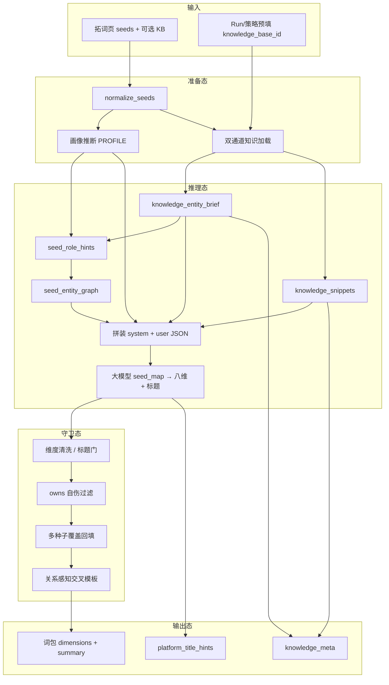
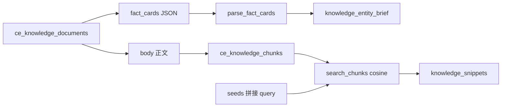
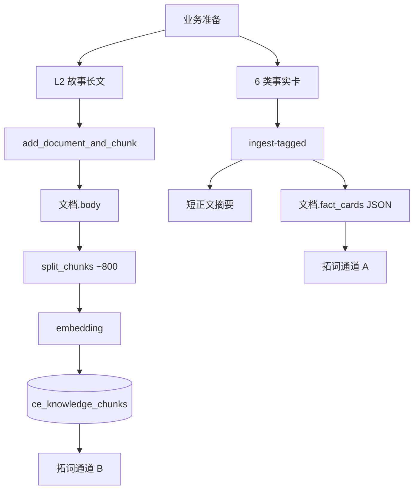

# 拓词步骤：数据流向与逐步加工

> 版本：2026-08-07  
> **定位**：GEO Suite **其中一步（拓词）** 的加工说明书，**不是**「拓词智能体」产品定义。  
> 全 Suite 能否做成智能体 → 见 [`GEO_SUITE_AS_AGENT.md`](./GEO_SUITE_AS_AGENT.md)。  
> 关联：[`AGENT_DESIGN_8_QUESTIONS.md`](./AGENT_DESIGN_8_QUESTIONS.md) · [`pilot-demo/szmg-diyixianchang-kb/README.md`](./pilot-demo/szmg-diyixianchang-kb/README.md)

本文说明拓词环节：**数据从哪来、每一步加工成什么、谁消费**，便于审计与讲解。

---

## 1. 总览：拓词子流水线（Suite 中的一步）

拓词不是「把种子丢给大模型」一步完成，而是固定顺序的加工管线：



| 阶段 | 角色类比 | 核心产出 |
|------|----------|----------|
| 准备态 | 解析用户意图 + 拉工具上下文 | `seeds[]`、`profile`、可选 brief/snippets |
| 推理态 | 规划（seed_map）+ 生成 | 八维 JSON、平台标题建议 |
| 守卫态 | 规则 / 政策过滤 + 缺口补齐 | 合法词面、覆盖全种子 |
| 输出态 | 结构化交付物 | `KeywordExpandResponse` |

---

## 2. 端到端数据流（字段级）

### 2.1 入口

| 来源 | 字段 | 说明 |
|------|------|------|
| 前端 `POST /api/keywords/expand` | `seeds: string[]` | 1～8；`;` 在服务端再拆 |
| 同上（可选） | `knowledge_base_id` | CE 知识库 UUID |
| 前端预填 | Run `artifacts.knowledge_base_id` 或策略 `knowledge_base_id` | 不强制；可清空 |

**加工**：`normalize_seeds`（[`keyword_expansion.py`](../backend/app/services/keyword_expansion.py)）

- 按 `;；,，` 拆分、去空白、去重、截断上限  
- **禁止**把 `深圳广电;第一现场` 当分词整串扩写  

**产出**：`normalized: string[]`

---

### 2.2 画像推断（无模型）

| 输入 | 加工 | 产出 |
|------|------|------|
| `normalized` | 规则命中 `PROFILE_LIBRARY`（媒体 / 消费电子 / …） | `profile{key,name,company_hint,keyword_strategy,blocked_terms,…}` |

用途：决定默认交叉话术风格、屏蔽词；**不**替代知识库隶属关系。

---

### 2.3 知识双通道（可选；有 `knowledge_base_id` 时）

实现：[`keyword_kb_context.load_knowledge_context`](../backend/app/services/keyword_kb_context.py)



#### 通道 A：事实卡 → Entity Brief（定关系）

| 步骤 | 输入 | 加工 | 产出 |
|------|------|------|------|
| 读库 | 该 KB 下未 retired 文档 | 收集全部 `fact_cards[]` | 原始卡片列表 |
| 解析 | `card_type` 等字段 | 归类 identity/owns/alias/angle/forbidden/competitor | `knowledge_entity_brief` |

**Brief 结构（概念）：**

```text
entities[]          名称 + role(organization|product_or_column|…) + aliases
owns_edges[]        {parent, child}   // 机构 ⊃ 栏目
alias_groups[][]    同实体别名簇
competitors[]       竞品名
forbidden[]         禁语
angles[]            选题角度短句
cards_used          卡片张数
rule                给模型的硬规则摘要
```

**业务含义**：卡片管「谁是谁、谁隶属谁、谁是竞品」——**不靠长文切片猜关系**。

#### 通道 B：正文切片 → Snippets（补语境）

| 步骤 | 输入 | 加工 | 产出 |
|------|------|------|------|
| 入库时 | L2 故事 `body` | `split_chunks(~800 字，双换行优先)` + embedding | `ce_knowledge_chunks` |
| 拓词时 | `query = seeds 拼接` | `search_chunks`（GEO 可检索过滤 + cosine top 4～6） | `snippets[{score,content,…}]` |

**业务含义**：切片只服务场景/问题式措辞；**禁止**把命中当成「实测引用率」。

挂到画像上供后续步骤使用：

```text
profile.knowledge_brief = brief
profile.knowledge_snippets = snippets
```

失败降级：库无效 / 检索异常 → 清空 brief/snippets，退回纯启发式（不阻断拓词）。

---

### 2.4 角色提示与实体图（轻量「规划」）

| 步骤 | 输入 | 加工 | 产出 |
|------|------|------|------|
| 字面启发式 | seeds | 标记 org/栏目/议题/属性近亲 | `seed_role_hints[]` |
| Brief 合并 | hints + brief | `merge_brief_into_role_hints`：**KB 优先**纠正 role、挂 `of`、标 alias | 修正后 hints |
| 构图 | hints | 别名成组、aspect 挂靠、canonical | `seed_entity_graph` |

**产出示例：**

```text
seed_role_hints:
  {seed: 深圳广电, hint_role: organization, …}
  {seed: 第一现场, hint_role: product_or_column, of: 深圳广电, …}

seed_entity_graph:
  canonical_entities / alias_groups / aspects / rule
```

---

### 2.5 提示词拼装（工具结果 → 模型上下文）

| 层 | 内容来源 | 作用 |
|----|----------|------|
| system | `keyword_expansion.system_prompt` + 多种子时 `MULTI_SEED_METHOD_ADDENDUM` | 方法：先 seed_map、标题门、GEO 方法口径 |
| user JSON | seeds、profile、hints、graph、**brief**、**snippets**、title_gate、正/反例、platforms | 单次任务说明书 |

模型被要求的内部步骤（写在 user.`steps`）：

1. 按 brief/graph 写 `seed_map`（实体/关系/选题主线）  
2. 标题第一关（question 维 + `platform_title_hints`）  
3. 按真关系扩八维（别名不交叉；owns 禁止互报）  
4. 按平台写标题建议  

---

### 2.6 大模型生成

| 输入 | 加工 | 期望产出 |
|------|------|----------|
| system + user | LLM `complete`（温度偏低） | JSON：`seed_map`（可选落盘在思维中）、`dimensions[8].items[]`、`platform_title_hints` |

超时 / 失败：`provider_succeeded=false` → 进入纯模板 fallback（仍走守卫态，且若有 brief 则交叉模板已 owns 感知）。

---

### 2.7 守卫态：清洗 · 过滤 · 回填

按维处理（每维约 10 词）：

| 步骤 | 输入 | 加工 | 去掉 / 补上什么 |
|------|------|------|----------------|
| `_sanitize_dimension_items` | 模型 raw items | 去空白、blocked_terms、低质后缀、**owns 自伤**、别名互啄 | 非法词面 |
| 标题门 | platform titles | `is_geo_title_acceptable` | 分号粘词、空泛「XX优化」等；不足**不补假标题** |
| `_ensure_multi_seed_coverage` | 清洗后 items | 某种子覆盖不足 → 单种子模板回填 | 避免只扩 seeds[0] |
| `_cross_seed_items` | 种子对 + brief | **owns 对**用「旗下/运营/定位」模板；**竞品对**用对比模板；媒体默认模板仅用于其它对 | 交叉席位 |
| owns 硬过滤 | 任意候选词 | `is_owns_self_harm_keyword`：两端同现且含「怎么报道/联动合作/对…报道怎么样」等，或命中 forbidden | 糙词 |

**自伤交叉反例（应滤）：** `深圳广电怎么报道第一现场`  
**合法交叉正例（应留）：** `深圳广电如何运营第一现场` / `深圳广电旗下第一现场`

---

### 2.8 输出态

| 字段 | 含义 |
|------|------|
| `seeds` | 归一化种子 |
| `profile` | 对外画像摘要（不含内部 brief） |
| `dimensions[]` | 八维词包（keyword / 推荐分 / 商业分 / reason） |
| `summary` | 计数与高分占比 |
| `platform_title_hints` | 各平台标题建议（可空） |
| `ai_focus` | 平台侧重说明（演示口径） |
| `knowledge_meta` | `{kb_id, cards_used, chunks_used, owns_edges, competitors}` — **可观测 / 可断言** |

下游：勾选词 → 策略写稿 / 内容任务 / Run handoff（可继续带同一 `knowledge_base_id`）。

---

## 3. 知识工程侧：入库时的数据流（给业务讲「怎么备」）

拓词聪明与否，一半取决于**入库形态**：



| 业务交付物 | 入库形态 | 拓词怎么用 |
|------------|----------|------------|
| 身份 / 隶属 / 别名 / 角度 / 禁语 / 竞品卡 | `fact_cards[]` 结构化 | 解析为 brief，硬约束关系 |
| 融媒/民生故事 | 正文 + 切片 | 检索补场景问法 |
| （错误示范）一张超长粘贴含关系句 | 易被切断 | 关系不稳定 → 仍会胡扩 |

示范包：[`pilot-demo/szmg-diyixianchang-kb/`](./pilot-demo/szmg-diyixianchang-kb/)。

---

## 4. 与 Suite 其它步的衔接

| 上游 | 如何接到拓词 |
|------|----------------|
| 知识页建库 / 导入示范包 | 产生 `knowledge_base_id` |
| GEO Run / 选题策略绑库 | 拓词页预填下拉 |
| 诊断 | 不直接改拓词；可影响选题种子 |

| 下游 | 拓词交出什么 |
|------|----------------|
| 策略确认问法 | 勾选 `query_variants` |
| 内容任务 | 词 + 可选同一 KB → 写稿再 `search_chunks` 填 `{{Knowledge}}` |
| 观测 | 问法质量影响后续探针设计（本链路不自动采样） |

完整业务闭环仍是：

`CreateRun → 诊断 → 知识 → 拓词 → 内容/分发 → 观测`

拓词这一环的「智能体感」来自：**工具拉知识 → 结构化规划输入 → 模型生成 → 规则守卫 → 可观测 meta**。

---

## 5. 关键代码索引

| 模块 | 路径 |
|------|------|
| API | `backend/app/api/routes/keywords.py` |
| Schema | `backend/app/schemas/keyword.py` |
| 拓词主流程 | `backend/app/services/keyword_expansion.py` |
| KB 双通道 / owns | `backend/app/services/keyword_kb_context.py` |
| 切片 / 检索 | `backend/app/services/content_engine.py`（`split_chunks` / `search_chunks`） |
| 入库分层 | `backend/app/services/geo_kb.py`（`ingest_tagged`） |
| 标题门 | `backend/app/services/geo_prompt_rules.py` |
| 提示词配置 | `backend/app/services/runtime_settings.py` |
| 前端 | `dist/js/keywords.js` · `dist/keywords.html` |

---

## 6. 讲解时可用的一句话

> **卡片定关系，切片补场景，模型写问法，规则守边界；`knowledge_meta` 让每一步用量可见。**

修订记录：2026-08-07 初版；更正标题——本文件仅为 Suite 拓词步加工说明，Suite 级 Agent 判断见 `GEO_SUITE_AS_AGENT.md`。
