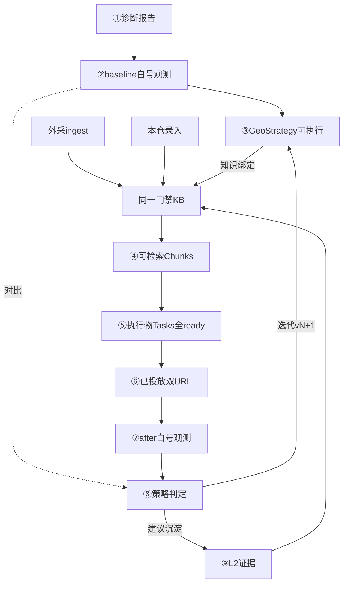

# 党建党媒 GEO 平台快速落地方案（PRD）

> 版本：2026-08-04-freeze · Grill 共识 + 白板①–⑨ + W1–W8 闸门落地冻结  
> 周期：≤2 个月（约 8 周）  
> 原则：正式项目，验收口径 = 上线口径；禁止演示/验收双轨降标  
> 实现入口：`/api/geo-strategies` · 看板 `/strategies` · 白号池 `/api/obs-white-accounts` · 诊断 `/diagnostic` · 观测 `real_obs`

---

## 1. 一句话

建设以 **GEO 策略** 为作业与验收本体的党建党媒平台：先 **诊断页面就绪**、再 **初次白号观测（baseline）** 摸清真相入口现状，然后定策略、备知识、生产供给并投放，用 **复测观测（after）** 判定策略是否生效，再迭代或沉淀证据。

内容生产（含 AI 起草）只是执行环，不是本体。

---

## 2. 组织与角色

| 角色 | 职责 |
|------|------|
| **editor** | 发起诊断/初次观测、策略起草、执行物编写、观测操作 |
| **reviewer** | 策略审批、稿件连续过审、策略判定确认、L2 沉淀确认；强制沉淀发起/业务确认 |
| **admin** | **技术支持**：账号/权限/排障/门禁/白号池；**强制沉淀终确闸门**。不承担日常策略业务审批 |

内部系统：技术部可兼 editor 起步；编辑部优先 reviewer 与外发排期。

---

## 3. 主链工作流（与白板对齐 · ①–⑨）

白板总流程强调：**诊断 →（摸底）观测 → 策略/知识/生产 → 分发 → 观测回流**。  
策略仍是本体；诊断与初次观测是定策前的硬前置，不是可选项。

```text
① 诊断（SEO/页面就绪）
② 初次观测 baseline（白号 × 问题类草案 × 目标平台）
③ 定策略（六元组；对照诊断+baseline 缺口）
④ 备知识（双入口门禁 + 策略绑定）
⑤ 执行供给（≥2 篇连续过审 ready）
⑥ 已投放（官网 + 任一媒体号，人工登记）
⑦ 复测观测 after（同一问题类 × 同平台，白号）
⑧ 策略判定（可对比 baseline→after）
⑨ 迭代策略新版本 / 建议沉淀 L2
```

| 环 | 谁主责 | 完成定义（本环出口闸门） |
|----|--------|--------------------------|
| ① 诊断 | editor | 有挂接策略（或即将成策的 Run）的诊断报告：缺口清单可用 |
| ② 初次观测 | editor 操作白号 | 目标平台 × ≥3 问法草案的 **baseline** 白号样本齐（允许 partial，但须有样本） |
| ③ 定策略 | editor 起草 / reviewer 审批 | 六元组齐全；起草人≠审批人；状态=可执行 |
| ④ 备知识 | 录入方 + 门禁 | 绑定文档集可 RAG；标签/主题包已填 |
| ⑤ 执行供给 | editor / reviewer | ≥2 篇且全部连续过审 ready |
| ⑥ 已投放 | 编辑部排期 | 官网 URL + 媒体号 URL 人工登记齐 |
| ⑦ 复测观测 | editor 操作白号 | after 快照：同平台 × ≥3 问法白号样本齐 |
| ⑧ 判定 | reviewer | 多数决 + 人确认；可引用 baseline 对比 |
| ⑨ 迭代/沉淀 | editor+reviewer；强制含 admin 终确 | 新版本或 L2 建议确认 |

**硬前置**：无 ① 诊断交付物、无 ② baseline，不得把策略批成「可执行」（正式口径）。  
**可等待复测**：⑤ 全稿过审 + ⑥ 已投放。  
**不是主线**：为发文而发文、按篇凑数、只有 after 没有 baseline、观测完不回写策略。

---

## 4. 环间交付物（每环交给下一环什么）

> 原则：上一环的**出口包** = 下一环的**入口包**。缺包不得过闸。

| 从 → 到 | 交付物（数据对象 / 字段） | 下一环怎么用 |
|---------|--------------------------|--------------|
| **①→②** | `DiagnosticReport`（或等价）：目标 URL、SEO 四模块缺口、运营向影响/建议、`geo_run_id` | 确定「页面侧先修什么」；为问法/主体别名提供线索；Run 继续挂观测 |
| **②→③** | `RealObsSnapshot(phase=baseline)` + Samples：平台、≥3 问法、提及/引用位次/无列表标记、白号标记 | 定策依据：现状是否已有提及、缺自有域、问法是否要命中；写入策略 `gap_note` / 成功信号加严 |
| **③→④** | `GeoStrategy` 可执行版：六元组（平台、问题类、问法≥3、内容取向、渠道矩阵、成功信号、**文档集∧标签包**）、`version`、`knowledge_base_id` | 按绑定范围补齐/确认 KB；缺文档则本仓录入或外采 ingest |
| **④→⑤** | 门禁通过的 `KnowledgeDocument[]` + Chunks（可检索）+ 策略绑定 ID 列表不变式 | RAG/起草只打这些料；生成深文+FAQ 等执行物 |
| **⑤→⑥** | `ContentTask[]`：≥2 篇、`workflow_status=ready`、渠道预览稿、策略 `task_summary.all_ready=true` | 人按矩阵真发；系统只接受登记，不代发 |
| **⑥→⑦** | 策略 `status=deployed` + `site_url` + `media_channel_type` + `media_url` + `deployed_at` | 建 after 快照；自有域从 `site_url` 解析；问法沿用策略问题类 |
| **⑦→⑧** | `RealObsSnapshot(phase=after)` + Samples（白号、展开引用后的位次） | 问法级生效/部分/未生效 → 策略级多数决建议 |
| **⑧→⑨** | `verdict` + `verdict_detail`（含可选 baseline 对比摘要）+ `promote_suggestion` | 生效→建议入 L2（reviewer 确认）；否则归因改策 → `fork` 新版本回到 ③/④ |
| **⑨→①/②**（下一轮） | 新策略版本（draft）或增厚后的 L2 文档 ID | 必要时重跑诊断/baseline，再开下一轮策略 |

### 4.1 交付物最小字段清单

| 交付包 | 最少字段 |
|--------|----------|
| 诊断包 | `report_id`, `url`, `gaps[]`, `impacts[]`, `geo_run_id` |
| baseline 包 | `snapshot_id`, `strategy_id`（可先挂 Run 再绑策略）, `platform`, `questions[≥3]`, `samples[]`, `account_type=white` |
| 策略可执行包 | 六元组全字段 + `approved_by` ≠ `created_by` |
| 知识就绪包 | `knowledge_document_ids[]`（均门禁可检）+ `knowledge_tag_pack` |
| 执行就绪包 | `task_ids[]`（≥2 且全 ready） |
| 已投放包 | `site_url`, `media_channel_type`, `media_url`, `deployed_at` |
| after 包 | 同 baseline 结构，`phase=after`，问法与平台与策略一致 |
| 判定包 | `verdict`, `query_results[]`, `judged_by`, `promote_suggestion` |

---

## 5. 数据流（端到端）



- **策略挂一切**：任务、baseline/after 快照、判定、沉淀建议均挂 `strategy_id`（或经 `geo_run_id` 过渡后回绑）  
- **执行物不是验收本体**：篇数服务于策略供给  
- **事实主源**：第一现场官网；媒体号为矩阵扩展  
- **观测两段**：baseline（定策前）+ after（投放后）；验收缺 baseline 不算完整策略闭环  

---

## 6. 策略对象（六元组）

一条可执行策略必须同时具备：

1. **目标平台**（一策略一平台：豆包 / 元宝 / DeepSeek）  
2. **问题类**（问法簇，观测用 ≥3 条问法）  
3. **内容供给取向**（深文+FAQ 等）  
4. **渠道矩阵**（最低：第一现场官网 + 任一媒体号）  
5. **成功信号**（默认见 §8；可加严不可默认放宽到「仅提及」）  
6. **知识绑定**（**文档集 document_id 列表 ∧ 标签/主题包** 同时必填）  

另建议挂接（正式闭环）：

- `diagnostic_report_id` / `geo_run_id`  
- `baseline_snapshot_id`  
- `after_snapshot_id`  

版本：投放前草稿可原地改；**判定后迭代必须 vN+1**，旧版只读。

---

## 7. 分发

| 项 | 口径 |
|----|------|
| 最低矩阵 | 第一现场官网（必）+ 任一媒体号（必） |
| 媒体号示例 | 公众号 / 头条号 / 抖音 / 百度百科 / 百度百家号等 |
| 系统职责 | 渠道预览 + **人工登记已投放** |
| 不做（本期） | 代发；各平台自动回写/回调验活 |
| 说明 | 「自动回写」≠ AI 采用写回；AI 采用走 ⑦→⑧→⑨ |

---

## 8. 观测与生效判定

**两段观测**

| 段 | 时机 | 目的 |
|----|------|------|
| **baseline 初次观测** | 定策前（②） | 摸清该问题类在目标平台现状 |
| **after 复测观测** | 已投放后（⑦） | 看策略是否带来提及+引用前10 |

**范围**：豆包 / 元宝 / DeepSeek；**正式观测必须白号**；固定查询号仅点名辅助，不算验收。  
**账号**：每平台 ≥5 白号；技术部备号，编辑部操作。

**问法级**

| 结果 | 条件 |
|------|------|
| 生效 | 约定主体/栏目**提及**，且引用位次进入**前 10** |
| 强采纳 | 生效 + 命中第一现场自有域（更高档） |
| 部分 | 有提及但未进前 10，或无法解析位次 |
| 未生效 | 无提及 |

- 折叠引用须 probe **展开**后再抽位次  
- 真无引用列表：该问法最多「部分」

**策略级（3 问法多数决，对 after）**：≥2/3 生效→策略生效；1/3→部分；0→未生效。  
判定详情宜附带 **baseline→after** 变化摘要（提及率/前10命中数）。

**强制沉淀**：reviewer 发起 → 另一业务人确认 → **admin 终确**。  
**生效后沉淀**：建议入 L2 → reviewer 确认；禁止无人值守自动写库。

---

## 9. AI 定位

| 环节 | AI | 人 |
|------|----|----|
| 诊断建议润色 | 可选 | 确认缺口是否进策略 |
| 定策略 | 问题簇/平台侧重建议 | 拍板与审批 |
| 备知识 | 提取、切片、组织 | 门禁确认 |
| 执行供给 | 起草、多渠适配 | 连续过审与外发 |
| 观测判定 | 抽取提及/引用/建议标签 | 确认生效与否 |
| 迭代 | 归因与改策建议 | 开新版本 |

---

## 10. 2 个月验收

- **业务可用**：真人按 ①–⑨ 周循环运转  
- **数量**：**6 条策略** = 2 问题类 × 三平台  
- **每条完整闭环必须含**：诊断包 → baseline → 可执行策略 → 知识就绪 → ≥2 篇全过审 → 双 URL 已投放 → after → 判定 → 迭代或沉淀建议  

缺 baseline 或只有 after，**不算**该条策略验收通过。

---

## 11. 8 周排期骨架（修订）

| 周 | 重点 |
|----|------|
| W1 | 策略对象；诊断/Run 与策略挂接；角色 |
| W2 | **baseline 初次观测**硬前置 + 六元组审批 |
| W3 | 知识绑定 → 执行物生产/连续过审 |
| W4 | 人工已投放 + after 观测（展开引用） |
| W5 | 判定（含 baseline 对比）+ 迭代 + L2 建议确认 |
| W6–W7 | 6 条策略完整 ①–⑨ |
| W8 | 冻结、运营手册（含环间交付物检查表） |

---

## 12. Grill 锁定索引与实现差距

仍有效：一策略一平台、六元组、白号、官网+媒体号、人工登记已投放、多数决、强制三闸、admin 不审日常业务等（原 Q14–Q30）。

**本修订新增/纠正**

- 主链恢复 **①诊断、②初次观测 baseline**  
- **§4 环间交付物**为验收检查表  
- 原「①缺口感知」不再替代诊断/初次观测，只作为种子入口的辅助说法  

**实现进度（相对本 PRD · 2026-08-04-freeze）**

| 项 | 现状 |
|----|------|
| 策略 API / 看板 | 已有；Stitch 墨蓝纸面 tokens |
| 诊断→策略硬挂接 | `POST .../attach-diagnostic`；审批前必填 |
| baseline 作为可执行前置 | `register-baseline` + `record-obs-samples`（phase=baseline） |
| after 快照 | `start-observe` + `record-obs-samples`（phase=after） |
| 白号池 | `/api/obs-white-accounts`（每平台≥5；可 seed 占位） |
| 知识 RAG 门禁 | 送审/批准校验绑定文档 `rag_eligible` |
| 稿件写≠审 | `approve-ready` 仅 reviewer；claimed≠reviewed；admin 不日常过审 |
| 强制沉淀三闸 | API + 看板按钮 |
| 环间交付物 | `handoff_checklist` |
| 6 策验收脚本 | `scripts/smoke_geo_strategy_six.py`（2 类×3 平台，fixture 样本） |

**本机冒烟**：`alembic upgrade head`（至 025）后：
- 服务层全流程：`python scripts/smoke_geo_strategy_e2e.py`
- 六策闸门：`python scripts/smoke_geo_strategy_six.py`
- HTTP 闸门：`python scripts/smoke_geo_strategy_api_http.py`（API :8010）
- 聚合：`python scripts/smoke_geo_strategy_flow.py --e2e`

**业务文档**（非技术科普）：
- 操作指南：[dangqun-geo-ops-guide.md](./dangqun-geo-ops-guide.md)
- 汇报 PPT 大纲：[dangqun-geo-report-ppt-outline.md](./dangqun-geo-report-ppt-outline.md)
